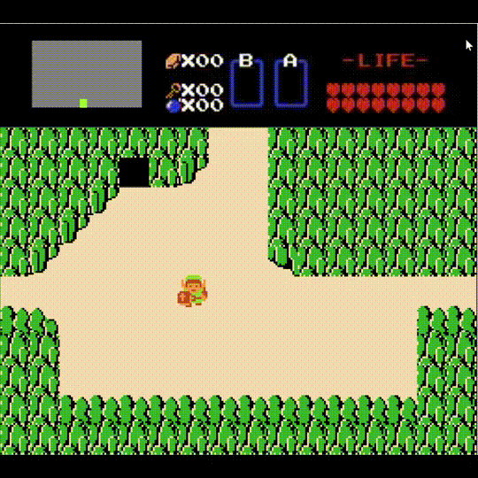

# Recreating The Legend of Zelda (NES) in MATLAB

This project is a fan-made recreation of the original *The Legend of Zelda* (NES, 1986) implemented in MATLAB.

It aims to reproduce the core gameplay mechanics of the original game, such as player movement, enemy behavior, map transitions, and basic combat, while exploring the possibilities of real-time game development using MATLAB.

This is an ongoing project and **not yet a full remake** of the original game.

---

## Features

- NES-style top-down 2D gameplay
- Tile-based map system
- Player movement and collision detection
- Sword attack system
- Area transitions and cave entry/exit
- Enemy spawning and basic interaction
- Damage display for both player and enemies
- MATLAB-based rendering and game loop
- Keyboard control
- Optional Joy-Con support (via HID API)

---

## Demo



---

## Environment

Tested on:

- Windows 11
- MATLAB R2024b
- Surface Pro 8

---

## How to Run

1. Clone this repository
2. Download the required sprite images from The Spriters Resource and place them in the appropriate folders.

Due to copyright reasons, the original game assets are not included in this repository.
You can download the original NES Zelda sprites from the following website:

https://www.spriters-resource.com/nes/legendofzelda/

Make sure the folder structure matches the expected layout in this project.

3. (Optional, but required for controller support)
If you want to use a controller such as Joy-Con, download the following external library and place it in the appropriate folder (e.g., ClassDef/):

matlab-hidapi
https://github.com/diggerdata/matlab-hidapi

4. Open MATLAB.
5. Navigate to the project folder.
6. Add the project folder (and its subfolders) to the MATLAB path.
7. Run the main script:

---

## Controls

### Keyboard
- W / A / S / D — Move
- Mouse click — Attack

### Controller (Optional)
- Joy-Con supported via HID API (if connected and configured)

---

## Project Structure

```
zelda-in-matlab/
├── ClassDef/              # Class definitions
│   ├── matlab-hidapi-master
│   ├── UI.m
│   ├── HUD.m
│   ├── Field.m
│   ├── PlayerCharacter.m
│   ├── Enemy.m
│   ├── NonPlayerCharacter.m
│   ├── JoyController.m
│   ├── mapPolygon.xlsx
│   ├── cavePolygon.xlsx
│   └── posEnemy.xlsx
├── Images/               # Sprite images and assets
│   ├── Miscellaneous - HUD & Pause Screen.png
│   ├── Overworld - Overworld (First Quest).png
│   ├── Playable Characters - Link.png
│   ├── Enemies & Bosses - Overworld Enemies.png
│   ├── Miscellaneous - Enemy Death.png
│   └── Miscellaneous - NPCs.png
├── main.m                # Entry point
├── getPlayerOperation.m  # Input handling
└── README.md
```

---

## Assets and Credits

### Sprite images

This project uses sprite images from *The Legend of Zelda* (NES).

Due to copyright reasons, the original game assets are not included in this repository.  
Please download the required sprites from **The Spriters Resource**:

https://www.spriters-resource.com/nes/legendofzelda/

All rights to these assets belong to their respective owners.

### hid-api

This project uses the following external library for controller input:

- **matlab-hidapi**  
  https://github.com/diggerdata/matlab-hidapi

This library is developed and maintained by its respective authors.
Please refer to the original repository for license details.

---

## Disclaimer

This is a fan-made, non-commercial project and is not affiliated with or endorsed by Nintendo.
All trademarks and copyrights belong to their respective owners.

---

## Motivation

This project was created as a technical and educational challenge to explore:
- Game development using MATLAB
- Real-time rendering and game loops
- Object-oriented design in MATLAB
- Reproducing classic NES game mechanics

---

## Limitations / ToDo

The following features are not implemented yet:
- Shield usage
- Sword beams
- Items other than sword
- Dungeon mechanics
- Boss enemies
- Title screen
- Pause menu

---

## Future Work

- Sound effects and background music
- More enemy types
- Additional areas
- Inventory system
- Save / load functionality

---

## License

This project is released for educational purposes only.
Please check individual asset licenses before redistributing.
